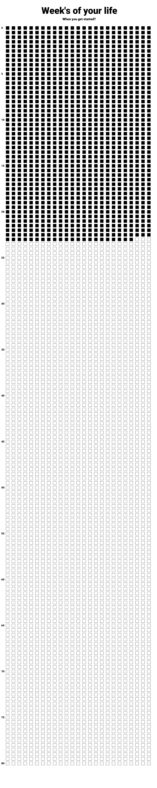

# Weeks of life
 
 This is a python module that creates for you a png file that based on your birthday remindes you how many weeks have passed till now.

 ## Example

 This is an example of how the picture will look based on date 9/9/1999 passed as argument in function.

 

 ## Usage

For usage just import the module and call one of two functions from main that will create the png based on your birthday and will fill the number of weeks that passed till when you run the module and will let the rest empty till 80 years. The difference between the two functions is that in one you enter directly the date and the other ask you through
terminal.
```python

from weekLife import main

main.createFromArgs(1999,9,9)

```
or

```python

from weekLife import main

main.createFromInput()

```

After you either one of these will find a file named life.png in current folder.

## Additional

This module is used just as remainder that you need to motivate yourself,that you don't need to let on tomorrow what you can do today. Also the calculus is not exactly, but made just to make a visual impact so please no hate.

## Contributing
Pull requests are welcome. For major changes, please open an issue first to discuss what you would like to change.

Please make sure to update tests as appropriate.

## License
[MIT](https://choosealicense.com/licenses/mit/)


